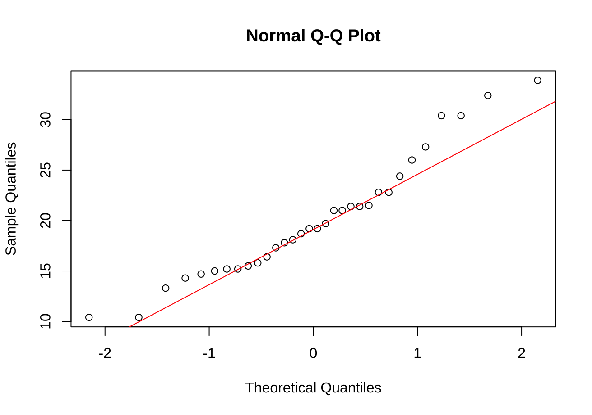

# 题目：

使用mtcars数据集，检验汽车的平均油耗(mpg)是否显著不同于20英里/加仑。

# 考点：

* 单样本t检验的应用
* 假设的设定（H₀与H₁）
* p值的解读
* 置信区间的计算与解释

# 单样本t检验分析思路

这道题目需要检验汽车的平均油耗(mpg)是否显著不同于20英里/加仑，是典型的单样本t检验应用场景。以下是完整分析思路：

# 1. 明确假设

原假设(H₀): 汽车的平均油耗等于20英里/加仑 (μ = 20)
备择假设(H₁): 汽车的平均油耗不等于20英里/加仑 (μ ≠ 20)

# 2. 确定检验类型

这是一个双尾检验，因为我们关心的是"是否不同于"而不是"大于"或"小于"
使用单样本t检验，因为我们只有一组样本数据，并将其与一个已知的固定值(20)进行比较

# 3. 检查前提条件

样本是否来自正态分布或样本量是否足够大（中心极限定理）
样本是否独立

## 检查正态性
> shapiro_test <- shapiro.test(mtcars$mpg)
> print(shapiro_test)

Shapiro-Wilk normality test
data:  mtcars$mpg
W = 0.94756, p-value = 0.1229

## 创建QQ图检查正态性
> qqnorm(mtcars$mpg)
> qqline(mtcars$mpg, col = "red")

# 4. 执行检验步骤
   计算样本平均值
   计算样本标准差
   计算标准误(SE = s/√n)
   计算t统计量: t = (x̄ - μ₀)/SE
   确定自由度: df = n - 1
   计算p值

p_value <- 2 * pt(abs(t_stat), df, lower.tail = FALSE)
双尾t检验p值计算公式详细解释
这个公式计算了双尾t检验的p值：p_value <- 2 * pt(abs(t_stat), df, lower.tail = FALSE)

公式拆解与原理解释
1. pt()函数
功能：R中计算t分布累积概率的函数
语法：pt(q, df, lower.tail)
返回值：给定自由度df的t分布中，概率密度函数在q处的累积概率
2. abs(t_stat)
目的：取t统计量的绝对值
原理：在双尾检验中，我们关心偏离假设均值的程度，而不关心方向(正或负)
例子：如果t = -2.5，我们用|t| = 2.5来计算
3. lower.tail = FALSE
含义：计算上尾(右尾)概率，即P(T > q)
对比：
lower.tail = TRUE：计算P(T ≤ q)，默认值
lower.tail = FALSE：计算P(T > q)
4. 乘以2的原因
双尾性质：检验"不等于"假设时，我们关心两个方向上的偏离
对称性：t分布是对称的，所以P(T < -|t|) = P(T > |t|)
合并：总p值 = P(T < -|t|) + P(T > |t|) = 2 × P(T > |t|)
计算示例与解释
在您的案例中：

t统计量 ≈ 0.08506
自由度 = 31
计算过程：

pt(0.08506, 31, lower.tail = FALSE) ≈ 0.46636
2 * 0.46636 ≈ 0.93272
图形表示
在t分布图上：

红色区域表示P(T > 0.08506)
绿色区域表示P(T < -0.08506)
p值 = 红色区域 + 绿色区域
CopyInsert
      绿色区域       |       红色区域
    <------------|------------->
                 |
                 0          t=0.08506
由于t值很小(0.08506)，红色和绿色区域加起来几乎占据了整个分布区域，导致p值接近1(0.9328)，表明几乎没有证据拒绝原假设。

这个高p值表明，观察到的样本均值与假设均值之间的差异很可能只是由随机抽样误差造成的，而不是真实存在的差异。

# 5. 解释结果
   如果p值 < 显著性水平(通常为0.05)，则拒绝原假设
   如果p值 ≥ 显著性水平，则不能拒绝原假设

# 6. 考察置信区间
   计算平均值的置信区间
   查看置信区间是否包含假设值(20)
   若包含，则支持不拒绝原假设
   若不包含，则支持拒绝原假设

# 7. 额外分析
   计算效应量以评估差异的实际大小
   可视化数据分布与假设值的关系
   这个分析过程遵循了统计假设检验的基本流程，从假设设定、检验选择、执行计算到解释结果，全面评估汽车平均油耗是否与假设值有显著差异。
