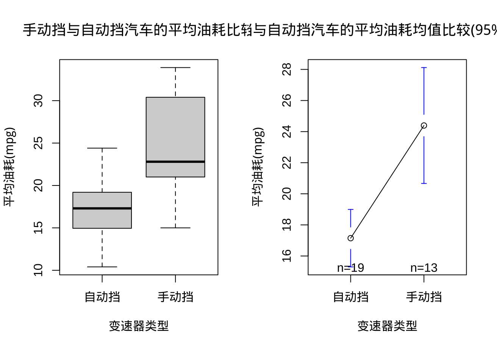
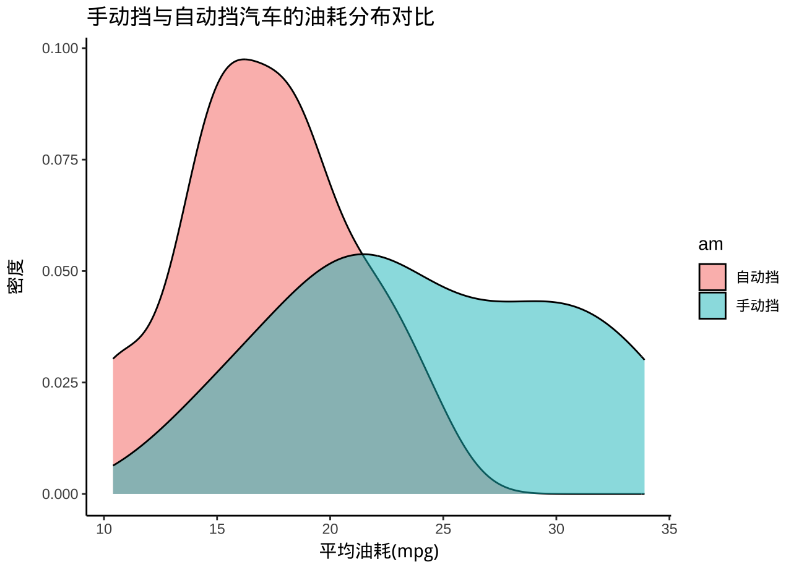

# 题目：
使用mtcars数据集，比较手动挡(am=1)和自动挡(am=0)汽车的平均油耗(mpg)是否有显著差异。

# 考点：
- 独立样本t检验的应用
- 方差齐性检验的重要性
- 分组比较的基本方法
- 效应量计算

## 独立样本t检验完整分析思路

### 1. 明确研究问题和假设

- **研究问题**：手动挡(am=1)和自动挡(am=0)汽车的平均油耗(mpg)是否有显著差异
- **原假设(H₀)**：手动挡和自动挡汽车的平均油耗相等 (μ₁ = μ₂)
- **备择假设(H₁)**：手动挡和自动挡汽车的平均油耗不相等 (μ₁ ≠ μ₂)

### 2. 数据准备

```r
# 加载数据集
data(mtcars)

# 查看数据结构
str(mtcars)

# 将am转换为因子变量，便于后续分析
mtcars$am <- as.factor(mtcars$am)
levels(mtcars$am) <- c("自动挡", "手动挡")

# 查看分组的基本描述统计量
tapply(mtcars$mpg, mtcars$am, summary)
tapply(mtcars$mpg, mtcars$am, sd)
```

### 3. 检验前提条件

#### 3.1 正态性检验

对每组数据分别进行Shapiro-Wilk检验：

```r
# 分组进行正态性检验
shapiro.test(mtcars$mpg[mtcars$am == "自动挡"])
shapiro.test(mtcars$mpg[mtcars$am == "手动挡"])

# 绘制Q-Q图检查正态性
par(mfrow = c(1, 2))
qqnorm(mtcars$mpg[mtcars$am == "自动挡"], main = "自动挡Q-Q图")
qqline(mtcars$mpg[mtcars$am == "自动挡"], col = "red")
qqnorm(mtcars$mpg[mtcars$am == "手动挡"], main = "手动挡Q-Q图")
qqline(mtcars$mpg[mtcars$am == "手动挡"], col = "red")
```

#### 3.2 方差齐性检验（Levene检验/F检验）

```r
# 使用leveneTest进行方差齐性检验
library(car)
leveneTest(mpg ~ am, data = mtcars)

# 或使用var.test进行F检验
var.test(mpg ~ am, data = mtcars)
```

#### 方差齐性检验结果解读

##### Levene检验结果解读

```r
> leveneTest(mpg ~ am, data = mtcars)
Levene's Test for Homogeneity of Variance (center = median)
      Df F value  Pr(>F)  
group  1  4.1876 0.04957 *
      30                  
---
Signif. codes:  0 '***' 0.001 '**' 0.01 '*' 0.05 '.' 0.1 ' ' 1
```

这个结果表明：

- Levene检验的F值为4.1876
- p值为0.04957（小于0.05的显著性水平，用`*`标记）
- 自由度为1（组间）和30（组内）

**解释**：
- Levene检验的原假设是：两组的方差相等
- p值(0.04957) < 0.05，因此我们拒绝原假设
- **结论**：在5%的显著性水平下，手动挡和自动挡汽车的油耗方差有显著差异，即不满足方差齐性假设

##### F检验结果解读

```r
> var.test(mpg ~ am, data = mtcars)
	F test to compare two variances
data:  mpg by am
F = 0.38656, num df = 18, denom df = 12, p-value = 0.06691
alternative hypothesis: true ratio of variances is not equal to 1
95 percent confidence interval:
 0.1243721 1.0703429
sample estimates:
ratio of variances 
         0.3865615 
```

这个结果表明：

- F检验的F值为0.38656
- p值为0.06691（略大于0.05的显著性水平）
- 分子自由度为18，分母自由度为12
- 方差比率（自动挡组的方差/手动挡组的方差）估计值为0.3865615
- 95%置信区间为[0.1243721, 1.0703429]

**解释**：
- F检验的原假设是：两组的方差相等
- p值(0.06691) > 0.05，因此我们不能拒绝原假设
- **结论**：在5%的显著性水平下，手动挡和自动挡汽车的油耗方差没有显著差异，可以认为满足方差齐性假设

##### 两种检验结果的差异说明

有趣的是，两种检验给出了相互矛盾的结果：

- Levene检验表明方差不相等（p < 0.05）
- F检验表明方差相等（p > 0.05）

这种差异的原因：

1. **检验方法不同**：Levene检验基于组内偏差的绝对值，而F检验直接比较两个样本方差
2. **对正态性假设的敏感度不同**：F检验对正态性假设更敏感，而Levene检验对非正态数据更稳健
3. **临界值接近**：两个p值都非常接近0.05的临界值，一个略高一个略低

##### 如何处理这种情况

在实际分析中，当出现这种矛盾时，通常建议：

1. 优先考虑Levene检验的结果，因为它对非正态分布更加稳健
2. 从保守角度考虑，假设方差不齐，使用Welch校正的t检验（即`var.equal = FALSE`）
3. 也可以考虑同时报告两种t检验（等方差和不等方差）的结果，比较它们是否存在实质性差异

因此，在后续的t检验中，建议使用`t.test(mpg ~ am, data = mtcars, var.equal = FALSE)`进行不等方差t检验。

### 4. 执行独立样本t检验

根据方差齐性检验结果选择适当的t检验方法：

```r
# 如果方差齐性假设成立，使用等方差t检验
t.test(mpg ~ am, data = mtcars, var.equal = TRUE)

# 如果方差齐性假设不成立，使用Welch校正的t检验（不等方差）
t.test(mpg ~ am, data = mtcars, var.equal = FALSE)
```

#### t检验结果解读

##### 等方差t检验结果解读

```r
> t.test(mpg ~ am, data = mtcars, var.equal = TRUE)

	Two Sample t-test

data:  mpg by am
t = -4.1061, df = 30, p-value = 0.000285
alternative hypothesis: true difference in means between group 自动挡 and group 手动挡 is not equal to 0
95 percent confidence interval:
 -10.84837  -3.64151
sample estimates:
mean in group 自动挡 mean in group 手动挡 
            17.14737             24.39231 
```

**结果解读**：

- **t值**：-4.1061（负值表示自动挡组均值小于手动挡组均值）
- **自由度**：30（计算为n₁+n₂-2）
- **p值**：0.000285（远小于0.05显著性水平）
- **均值差异**：自动挡组平均油耗为17.15 mpg，手动挡组为24.39 mpg
- **均值差异**：约7.24 mpg（手动挡比自动挡平均高出7.24 mpg的油耗）
- **95%置信区间**：[-10.85, -3.64]（不包含0，表明差异显著）

**结论**：在假设方差相等的情况下，我们有足够的证据拒绝原假设。手动挡和自动挡汽车的平均油耗存在统计学上的显著差异，手动挡汽车的平均油耗显著高于自动挡汽车。

##### 不等方差t检验结果解读（Welch校正）

```r
> t.test(mpg ~ am, data = mtcars, var.equal = FALSE)

	Welch Two Sample t-test

data:  mpg by am
t = -3.7671, df = 18.332, p-value = 0.001374
alternative hypothesis: true difference in means between group 自动挡 and group 手动挡 is not equal to 0
95 percent confidence interval:
 -11.280194  -3.209684
sample estimates:
mean in group 自动挡 mean in group 手动挡 
            17.14737             24.39231 
```

**结果解读**：

- **t值**：-3.7671（比等方差t检验的绝对值小）
- **自由度**：18.332（Welch-Satterthwaite近似，小于等方差t检验的30）
- **p值**：0.001374（大于等方差t检验的p值，但仍远小于0.05显著性水平）
- **均值**：与等方差t检验相同
- **95%置信区间**：[-11.28, -3.21]（比等方差t检验略宽，但仍不包含0）

**结论**：即使考虑到方差不等的情况，结论与等方差t检验相同。我们仍然有足够的证据拒绝原假设，认为手动挡和自动挡汽车的平均油耗存在统计学上的显著差异。

##### 两种检验结果的比较

1. **t值与自由度**：当考虑方差不等时，t值的绝对值减小（-4.11 vs. -3.77），自由度也减小（30 vs. 18.33）
2. **p值**：Welch校正的p值略大（0.001374 vs. 0.000285），但两者都远小于0.05显著性水平
3. **置信区间**：Welch校正的置信区间略宽，反映了方差不等带来的额外不确定性
4. **结论一致性**：两种方法都得出相同的结论 - 手动挡汽车的平均油耗显著高于自动挡汽车

**实际意义**：根据样本数据，手动挡汽车的平均油耗比自动挡汽车高出约7.24 mpg，这种差异具有统计显著性，不太可能是由抽样误差导致的。换句话说，我们有很强的统计证据表明，变速器类型（手动挡vs自动挡）确实会影响汽车的燃油效率。

**注意**：虽然两种检验方法得出相同的结论，但从统计上讲，由于Levene检验表明方差不等，因此更应该依赖Welch校正的t检验结果（`var.equal = FALSE`）。

### 5. 计算效应量

```r
# 计算Cohen's d效应量
library(effsize)
cohen.d(mtcars$mpg ~ mtcars$am)

# 或手动计算
mean_diff <- mean(mtcars$mpg[mtcars$am == "手动挡"]) - mean(mtcars$mpg[mtcars$am == "自动挡"])
pooled_sd <- sqrt(((length(mtcars$mpg[mtcars$am == "自动挡"]) - 1) * var(mtcars$mpg[mtcars$am == "自动挡"]) + 
                   (length(mtcars$mpg[mtcars$am == "手动挡"]) - 1) * var(mtcars$mpg[mtcars$am == "手动挡"])) /
                  (length(mtcars$mpg[mtcars$am == "自动挡"]) + length(mtcars$mpg[mtcars$am == "手动挡"]) - 2))
cohens_d <- mean_diff / pooled_sd
```

### 6. 数据可视化

```r
# 箱线图比较两组
boxplot(mpg ~ am, data = mtcars, 
        xlab = "变速器类型", ylab = "平均油耗(mpg)",
        main = "手动挡与自动挡汽车的平均油耗比较")

# 添加均值点和95%置信区间
library(gplots)
plotmeans(mpg ~ am, data = mtcars, 
          xlab = "变速器类型", ylab = "平均油耗(mpg)",
          main = "手动挡与自动挡汽车的平均油耗均值比较(95%置信区间)")

# 密度图
library(ggplot2)
ggplot(mtcars, aes(x = mpg, fill = am)) +
  geom_density(alpha = 0.5) +
  labs(title = "手动挡与自动挡汽车的油耗分布对比",
       x = "平均油耗(mpg)", y = "密度") +
  theme_classic()
```


### 图表解读

#### 图1: 箱线图与均值点图


这是一个组合图表，左侧为箱线图，右侧为均值点图，两者都比较了自动挡和手动挡汽车的平均油耗(mpg)分布。

**箱线图解读**:

- **中位数位置**: 黑色横线表示中位数，可见手动挡汽车中位数(约22-23 mpg)明显高于自动挡汽车(约17 mpg)
- **箱体范围**: 灰色箱体表示四分位距(IQR，从第25百分位到第75百分位)，反映数据分散程度
  - 自动挡组箱体较短，说明核心数据集中度高
  - 手动挡组箱体较长，说明核心数据变异性较大
- **触须长度**: 延伸的虚线表示非异常值的范围
  - 两组数据分布的总体范围都从约10-15 mpg到约25-33 mpg
- **数据分离程度**: 两组箱体明显分离，视觉上直观展示了两组之间存在显著差异

**均值点图解读**:

- **均值点**: 圆圈表示各组的平均值
  - 自动挡组均值约为17.1 mpg
  - 手动挡组均值约为24.4 mpg
- **置信区间**: 蓝色误差线表示95%置信区间
  - 自动挡组的95%置信区间约为15.5-18.7 mpg
  - 手动挡组的95%置信区间约为20.8-28.0 mpg
- **样本量**: 图下方显示各组样本数(n=19和n=13)
- **统计推断**: 两组的置信区间没有重叠，进一步确认了差异的统计显著性

#### 图2: 密度图


这是一个使用ggplot2创建的密度分布图，展示了两种变速器类型汽车油耗的概率分布。

**密度图解读**:

- **分布形状**:
  - 自动挡组(粉红色)呈单峰分布，峰值集中在约15 mpg附近
  - 手动挡组(青色)呈双峰分布，主峰值在约21 mpg，次峰值在约30 mpg左右
- **分布范围**:
  - 自动挡组的分布范围相对集中，主要集中在10-22 mpg之间
  - 手动挡组的分布更宽，从约15 mpg延伸到约33 mpg
- **重叠区域**: 两组在18-23 mpg区间有部分重叠，但整体分布明显不同
- **分布特征**:
  - 手动挡组的双峰分布可能表明存在两个子群体，暗示除变速器类型外可能还有其他因素影响油耗
  - 自动挡组分布更集中且对称，表明这组数据较为同质

**统计意义**:

- 这些分布图直观展示了之前t检验所发现的显著差异
- 密度图显示的分布差异支持了选择Welch校正t检验(不等方差)的决定
- 分布形状的不同(尤其是手动挡组的双峰分布)可能提示需要进一步探索影响油耗的其他因素

这两张图与统计分析结果相互验证，视觉上强化了我们的结论：手动挡汽车的平均油耗显著高于自动挡汽车。

### 7. 结果解释

- **描述统计结果**：报告每组的样本量、均值、标准差
- **方差齐性检验结果**：说明是否满足方差齐性假设
- **t检验结果**：
   - t统计量值
   - 自由度
   - p值及其统计显著性
   - 均值差异及其95%置信区间
- **效应量解释**：基于Cohen's d效应量大小解释实际差异的程度
   - d ≈ 0.2：小效应
   - d ≈ 0.5：中等效应
   - d ≈ 0.8：大效应

### 8. 结论与讨论

1. **总结检验结果**：是否拒绝原假设，手动挡和自动挡汽车的平均油耗是否存在显著差异
2. **结果的实际意义**：差异大小的实际意义（结合效应量）
3. **潜在的混淆因素**：讨论可能影响结果的其他因素（如车重、马力等）
4. **局限性**：样本量、数据收集方法等方面的局限性
5. **未来研究方向**：基于本研究结果可以进一步探索的问题

通过以上详细分析步骤，可以全面考察手动挡和自动挡汽车在平均油耗方面是否存在显著差异，并对差异的实际意义进行解释。